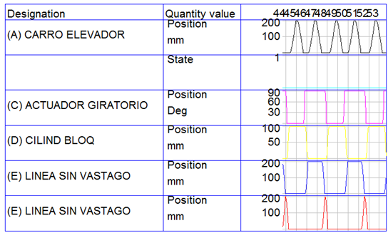
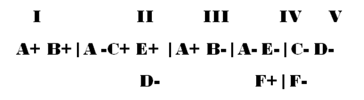
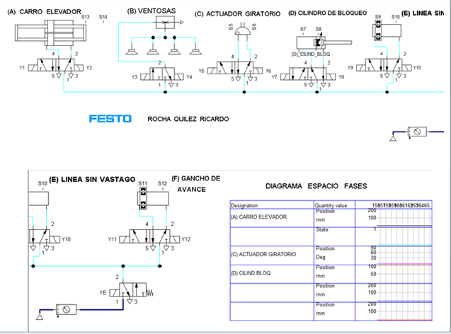
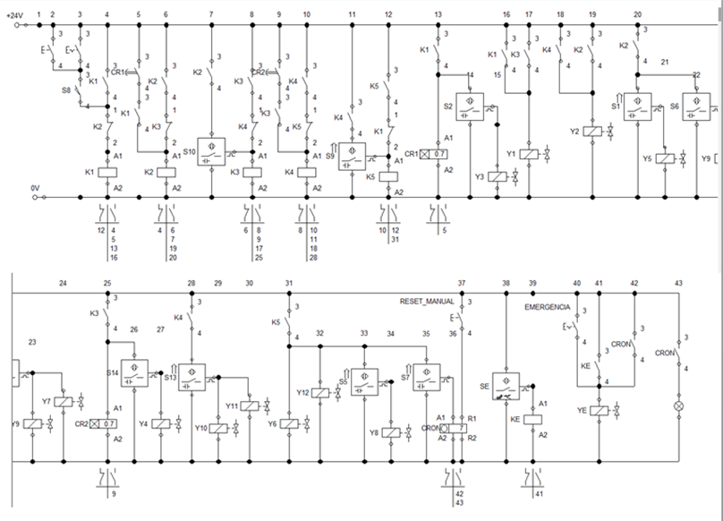

# ENSAMBLAJE DE LATAS

- A     ------------------CARRO ELEVADOR
- B    -------------------VENTOSAS
- C    ------------------ACTUADOR GIRATORIO
- D   -------------------CILINDRO DE BLOQUEO
- E   -------------------LINEA SIN VASTAGO
- F   ---------------------GANCHO DE AVANCE

# Procedimiento
- Instalar FluidSim
A+  El carro elevador se acerca a las latas
B+ Final de carrera A activa las ventosas 
Cambio de grupo. Se activa con final de carrera de A con un temporizador que se ajusta la cantidad de tiempo que tarda en actuar las ventosas 

A- El carro elevador se regresa con 
C+  Regreso de A actúa el Actuador giratorio gira 90 grados y s ajusta a la línea de cajas.
E+ D-  a los 90 grados del actuador giratorio (C) actúa  la línea de vástago (E) mandando el carrete por encima de las cajas y también regresando (D)  permitiendo el avance de mas latas en la línea de entrada.
Final de carrera de E activa grupo III
A+ Avanza carro elevador y deja cajas en su posición
B- Final de carrera de A desactiva las ventosas
Cambio de grupo .Se activa con final de carrera de A con un temporizador que se ajusta la cantidad de tiempo que tarda en actuar las ventosas   IV

A-	Regresa el carro elevador
E- F+ Regreso de A activa la línea sin vástago  y también se extiende la otra línea sin vástago F donde se coloca el gancho 
Al regreso de la línea sin vástago  cambia de grupo a V

C-	F-  Actuador giratorio regresa a 0grados y  la línea sin vástago F que tiene el gancho regresa atrayendo la banda 
D+  cuando regresa el actuador giratorio a 0 se vuelve a bloquear el paso de botellas 
 
Se dispone de un botón pulsador y un botón con retención para iniciar el proceso manual  o automático.
Se colocó una válvula electro neumática normalmente abierta que se cierra con el solenoide YE.
a)	El solenoide se activa con un botón pulsador con retención que funciona como paro de emergencia.
b)	También  se cuenta con un relevador KE que se activa con un sensor óptico que se puede colocar en las zonas más peligrosas donde no debe haber objetos obstruyendo al sistema o que alguien coloque una extremidad entre el desplazamiento de los actuadores.
Cualquiera de estos detiene el sistema.

